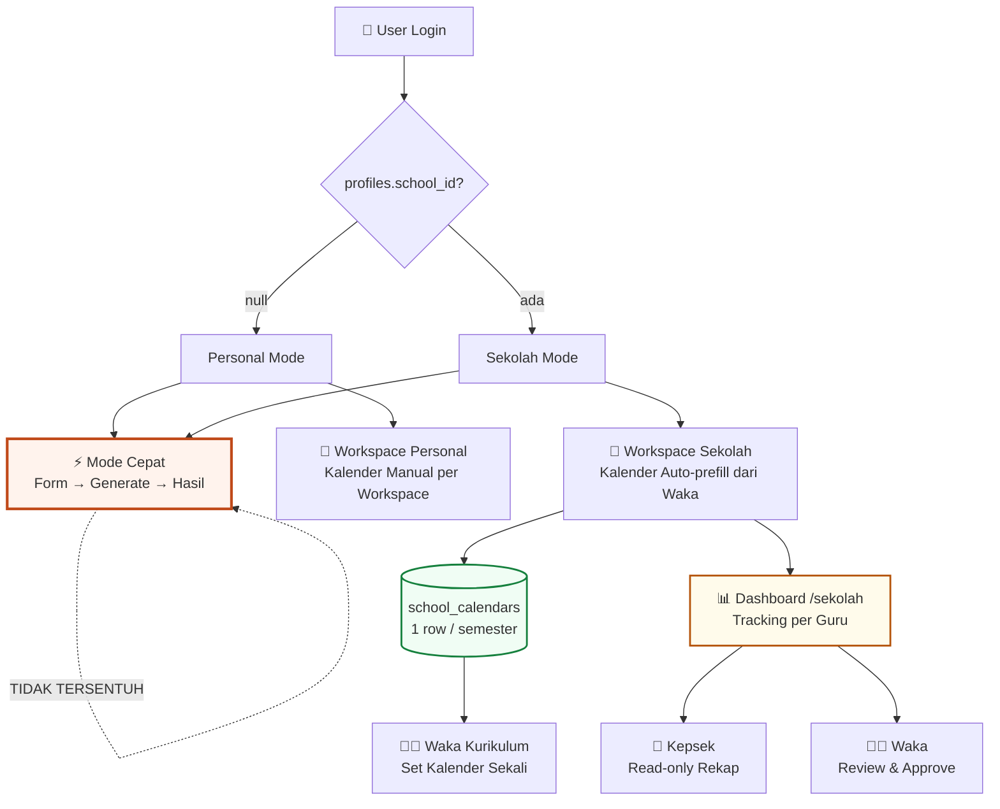
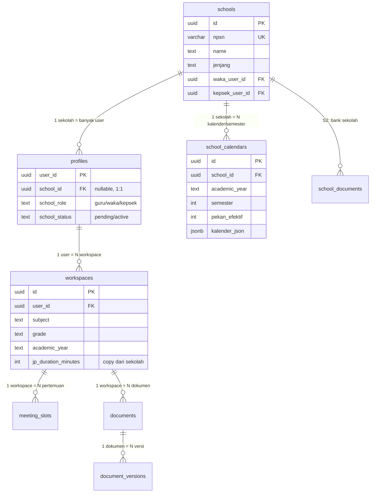
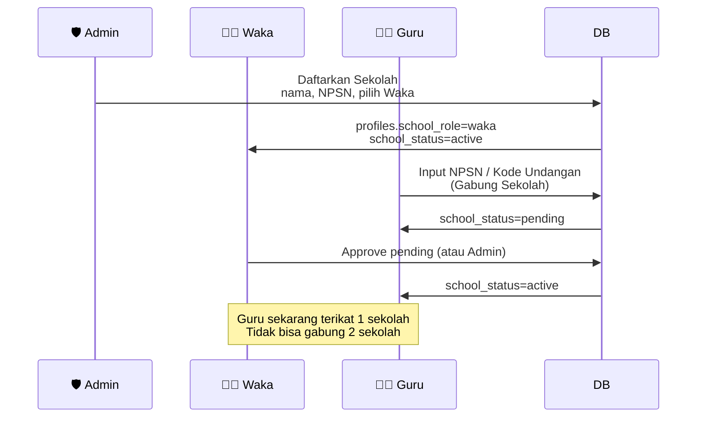
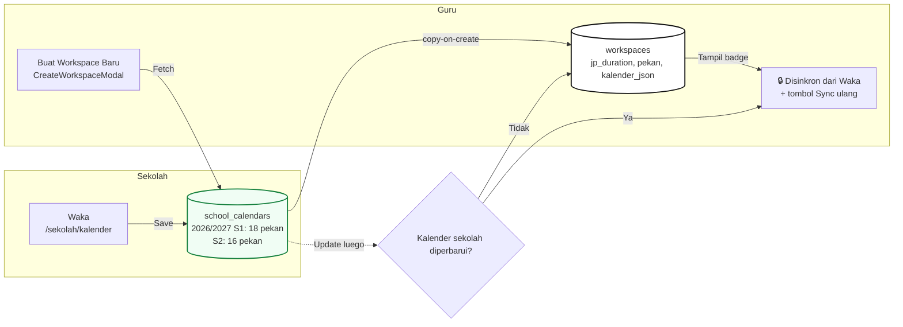
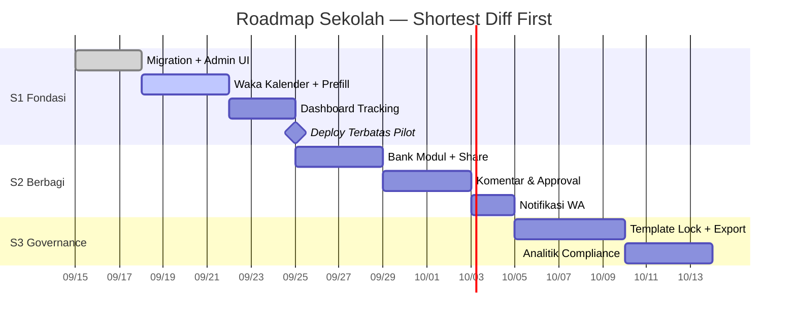

# MAP — ModulAjar Sekolah (Personal → Sekolah)

> Dokumen panduan pengembangan. Satu sumber kebenaran untuk fase Sekolah.
> Prinsip: Mode Cepat tidak tersentuh. Workspace tetap personal. Sekolah = layer organisasi yang supply default & tracking di atas workspace.

---

## 0. Ringkasan Eksekutif

**Masalah:** Guru isi Kalender Pendidikan & Pekan Efektif manual per workspace, padahal Waka Kurikulum sudah buat versi sekolah. Hasil: duplikasi, tidak sinkron, kepsek tidak bisa tracking progress modul ajar per guru.

**Solusi:** Tambah entitas `Sekolah` sebagai tenant. Waka set `Kalender Pendidikan` + `Pekan Efektif` sekali per tahun ajaran → semua workspace guru di sekolah tersebut auto-prefill. Kepsek/Waka dapat dashboard tracking + feedback. Mode Cepat tetap jalan tanpa sekolah.

**Constraint yang sudah disepakati:**
1. 1 guru = 1 sekolah (tidak boleh gabung 2 sekolah)
2. Sekolah hanya dibuat/di-approve Admin (guru tidak bisa self-create)
3. Mode Cepat tidak boleh tersentuh sama sekali

---

## 1. Arsitektur 3-Layer (tetap)

```
Layer 1 Directive (directives/*.md)  → SOP: apa yang dikerjakan
Layer 2 Orchestration (kamu/AI)      → routing, urutan eksekusi, handle error
Layer 3 Execution (execution/*.py)   → script deterministik, panggil API/DB
```

Sekolah menambah directive baru: `directives/sekolah.md` dan script `execution/sync_school_calendar.py` (jika perlu), tapi tidak mengubah script generate yang sudah ada.

---

## 2. Status Sekarang vs Target

| Aspek | Sekarang | Target Sekolah |
|---|---|---|
| Kepemilikan | `workspaces.user_id = auth.uid()` | Tetap. Sekolah tidak ambil alih ownership. |
| Kalender | `KalenderPendidikanForm` per workspace, manual | `school_calendars` milik Waka, diwariskan (copy-on-create) |
| Pekan Efektif | Input manual per guru | Set Waka sekali, auto-prefill |
| Berbagi modul | Tidak ada | Bank Sekolah (copy ke koleksi sekolah) |
| Tracking | Tidak ada | Dashboard `/sekolah` untuk Waka/Kepsek |
| Role | `admin`/`user` (user_roles) | Tambah `school_role` di profiles: `guru`/`waka`/`kepsek` |
| Mode Cepat | Campur state workspace | Steril, tidak import school context |

File relevan sekarang:
- `src/types/workspace.ts` — tipe Workspace, CurriculumPlan, MeetingSlot, Document
- `supabase/migrations/20260817101010_workspace_phase3.sql` — RLS personal
- `src/components/workspace/CreateWorkspaceModal.tsx` — titik prefill kalender
- `src/components/modul/KalenderPendidikanForm.tsx` — form yang akan jadi read-only jika dari sekolah
- `src/App.tsx` — routing, tempat mount `SchoolProvider` (hanya di dalam Workspace branch)

---

## 3. Data Model (Minimal, Lazy)

### 3.1 Tabel baru

```sql
-- 1. Sekolah (tenant)
create table public.schools (
  id uuid primary key default gen_random_uuid(),
  npsn varchar(12) unique, -- NPSN resmi, nullable jika belum ada
  name text not null,
  jenjang text check (jenjang in ('"'"'SD'"'"','"'"'SMP'"'"','"'"'SMA'"'"','"'"'SMK'"'"','"'"'MA'"'"','"'"'MI'"'"','"'"'MTS'"'"')),
  alamat text,
  waka_user_id uuid references auth.users(id),
  kepsek_user_id uuid references auth.users(id),
  academic_year_active text, -- ex: '"'"'2026/2027'"'"'
  created_by uuid references auth.users(id), -- admin yang daftarkan
  created_at timestamptz default now(),
  updated_at timestamptz default now()
);

-- 2. Kalender Sekolah (1 row per sekolah per tahun ajaran per semester)
create table public.school_calendars (
  id uuid primary key default gen_random_uuid(),
  school_id uuid not null references public.schools(id) on delete cascade,
  academic_year text not null, -- '"'"'2026/2027'"'"'
  semester smallint not null check (semester in (1,2)),
  pekan_efektif int not null,
  kalender_json jsonb not null default '"'"'{}'"'"', -- { libur: [], awalSemester, akhirSemester, jeda, ... }
  jp_duration_minutes int, -- override default sekolah jika ada
  created_by uuid references auth.users(id),
  updated_at timestamptz default now(),
  unique(school_id, academic_year, semester)
);

-- 3. (opsional S2) Bank Modul Sekolah — copy dokumen yang dibagikan
create table public.school_documents (
  id uuid primary key default gen_random_uuid(),
  school_id uuid not null references public.schools(id) on delete cascade,
  source_document_id uuid references public.documents(id) on delete set null,
  source_version_id uuid references public.document_versions(id) on delete set null,
  title text not null,
  document_type text not null,
  content_json jsonb,
  shared_by uuid references auth.users(id),
  created_at timestamptz default now()
);
```

### 3.2 Alter profiles (1 sekolah per user)

```sql
alter table public.profiles
  add column school_id uuid references public.schools(id) on delete set null,
  add column school_role text check (school_role in ('"'"'guru'"'"','"'"'waka'"'"','"'"'kepsek'"'"')),
  add column school_status text check (school_status in ('"'"'pending'"'"','"'"'active'"'"','"'"'rejected'"'"')) default '"'"'active'"'"';

create index idx_profiles_school on public.profiles(school_id);
-- ponytail: 1 kolom school_id = ceiling 1 sekolah/user. Upgrade ke school_members jika butuh pindah sekolah.
```

### 3.3 Tidak ubah workspaces

`workspaces` tetap `user_id, subject, phase, grade, academic_year, jp_duration_minutes, ...`
Prefill dilakukan di aplikasi (copy value), bukan FK. Alasan: workspace tetap personal, bisa diarsip, tidak cascade break jika kalender sekolah diubah.

---

## 4. RLS & Izin

### 4.1 Role existing tetap

`public.has_role(auth.uid(), '"'"'admin'"'"')` tetap untuk admin global.

### 4.2 RLS baru

```sql
alter table public.schools enable row level security;
alter table public.school_calendars enable row level security;

-- Semua member sekolah bisa lihat sekolahnya
create policy "Members can view own school"
  on public.schools for select using (
    id in (select school_id from public.profiles where user_id = auth.uid())
    or public.has_role(auth.uid(), '"'"'admin'"'"')
  );

-- Hanya admin bisa insert sekolah
create policy "Admin can insert schools"
  on public.schools for insert with check (public.has_role(auth.uid(), '"'"'admin'"'"'));

-- Hanya waka/kepsek/admin bisa update sekolah
create policy "Waka/Kepsek/Admin can update school"
  on public.schools for update using (
    public.has_role(auth.uid(), '"'"'admin'"'"')
    or waka_user_id = auth.uid()
    or kepsek_user_id = auth.uid()
  );

-- Kalender: semua member bisa select
create policy "Members can view school calendars"
  on public.school_calendars for select using (
    school_id in (select school_id from public.profiles where user_id = auth.uid())
  );
-- Hanya waka/admin bisa upsert
create policy "Waka/Admin can manage calendars"
  on public.school_calendars for all using (
    public.has_role(auth.uid(), '"'"'admin'"'"')
    or school_id in (select school_id from public.profiles where user_id = auth.uid() and school_role = '"'"'waka'"'"')
  );
```

`workspaces`, `documents` RLS tidak diubah (tetap `user_id = auth.uid()`). Sekolah tidak butuh akses silang workspace di DB; dashboard agregasi pakai view/RPC `SECURITY DEFINER` yang filter by `profiles.school_id`.

---

## 5. Flow Utama

### 5.1 Provisioning Sekolah (Admin-gated)

```
Admin (/admin/schools)
  ├─ "Daftarkan Sekolah" → input: nama, NPSN, jenjang, pilih user Waka (search by email), pilih user Kepsek (opsional)
  │   └─ insert schools + update profiles set school_id, school_role, school_status=active untuk waka/kepsek
  │
  └─ "Approve Request" → guru mengajukan gabung via kode NPSN
        └─ profiles where school_status=pending → admin/waka klik Approve → active
```

Guru flow:
```
Guru daftar/login → Banner "Gabung Sekolah" → input NPSN/kode undangan → profiles.school_status=pending
→ tunggu approve → setelah active, semua workspace baru auto-prefill kalender sekolah
```

Tidak ada tombol "Buat Sekolah" untuk role guru.

### 5.2 Kalender Pendidikan — Waka set sekali, Guru warisi

```
Waka: /sekolah/kalender → pilih Tahun Ajaran + Semester → isi pekan_efektif, tanggal libur, awal/akhir
      → save ke school_calendars

Guru: /app/workspace → "Buat Workspace Baru" (CreateWorkspaceModal)
      → jika profiles.school_id != null
           → fetch school_calendars where school_id & academic_year & semester
           → prefill field: jp_duration_minutes, weekly_jp_pattern, pekan_efektif, kalender_json
           → tampil badge "Disinkron dari Kalender Sekolah — Waka Kurikulum"
           → field jadi read-only dengan link "Lihat Kalender Sekolah" + tombol "Sync ulang" jika outdated
      → else (tidak sekolah) → form manual seperti sekarang

Update: jika waka ubah school_calendars setelah workspace dibuat
      → workspace tidak auto-tertimpa (copy-on-create)
      → di WorkspaceSettingsModal tampil alert "Kalender sekolah diperbarui, sync?"
      → guru klik Sync → overwrite field workspace dari school_calendars
```

### 5.3 Workspace Creation — Titik Integrasi Satu-satunya

Hanya 2 file yang disentuh:
- `src/components/workspace/CreateWorkspaceModal.tsx` — tambah fetch school_calendars + prefill
- `src/components/workspace/WorkspaceSettingsModal.tsx` — tambah banner sync

Tidak ada perubahan di `pertemuan-generation.ts`, `generate-content`, atau Mode Cepat.

### 5.4 Tracking — Dashboard Waka/Kepsek

Route baru: `/sekolah` (hanya jika `profiles.school_id != null` dan `school_role in (waka,kepsek)`, guru juga bisa read-only versi ringkas)

Data source: RPC `get_school_progress(school_id)` SECURITY DEFINER:

```sql
-- return per guru: total workspace, total JP alokasi, JP sudah jadi modul, % progress, dokumen pending review
select
  p.user_id, p.display_name, p.school_role,
  count(distinct w.id) as workspace_count,
  coalesce(sum(ms.planned_jp),0) as total_jp,
  count(distinct d.id) filter (where d.status in ('"'"'ready'"'"','"'"'completed'"'"')) as modul_jadi
from profiles p
left join workspaces w on w.user_id = p.user_id
left join meeting_slots ms on ms.workspace_id = w.id
left join documents d on d.workspace_id = w.id
where p.school_id = :school_id and p.school_status='"'"'active'"'"'
group by p.user_id;
```

UI:
- Kartu ringkas: Total Guru, Total Workspace, Modul Jadi / Belum, % ketuntasan sekolah
- Tabel per guru: Nama | Mapel | Kelas | Progress bar | Status (merah <30%, kuning 30-70%, hijau >70%)
- Filter: Tahun Ajaran, Semester, Fase
- Klik baris → drill-down ke workspace guru (read-only)

Guru lihat versi sendiri saja: "Progress Saya vs Rata-rata Sekolah" (anonim).

### 5.5 Bank Modul & Feedback (S2, tidak di S1)

- Guru: di DocumentPreview → "Bagikan ke Bank Sekolah" → copy ke `school_documents`
- Waka: /sekolah/bank → lihat, beri komentar, set status `disetujui/direvisi`, jadikan template
- Notifikasi: trigger setelah `create_document_version` → kirim WA via automation (sesuai AGENTS.md pengumuman)
```

---

## 6. Routing & Guard

```
App.tsx
├─ /                    → Landing
├─ /auth                → Auth
├─ /app/*               → ProtectedRoute → Index (Mode Cepat vs Workspace)
│     ├─ appMode=quick      → Form + Result (TIDAK mount SchoolProvider)
│     └─ appMode=workspace  → WorkspaceProvider (+ SchoolProvider jika profiles.school_id)
│           ├─ WorkspaceSelector, Dashboard, Planning, Prota, Prosem, Meeting
│           └─ banner Kalender Sekolah jika ada
├─ /sekolah             → ProtectedRoute + SchoolGate (school_id required, role waka/kepsek for write)
│     ├─ /sekolah              → Dashboard tracking
│     ├─ /sekolah/kalender     → Kelola school_calendars (waka only)
│     ├─ /sekolah/bank         → Bank Modul (S2)
│     └─ /sekolah/anggota      → Kelola anggota (waka/admin)
├─ /admin/schools       → AdminRoute → CRUD schools + approve pending
└─ /settings            → Profile + status sekolah
```

Guard:
- `SchoolGate`: if !profiles.school_id → redirect to /settings with banner "Belum gabung sekolah"
- `WakaGate`: if school_role != '"'"'waka'"'"' and !has_role(admin) → read-only
- Mode Cepat: tidak ada gate sekolah sama sekali

---

## 7. Fase Pengembangan (Lazy — Shortest Diff First)

### Fase S1 — Fondasi Sekolah + Kalender Warisan (1–2 minggu) — WAJIB

Tujuan: buktikan value tanpa sentuh Mode Cepat, tanpa RLS kompleks.

- [ ] Migration: `schools`, `school_calendars`, alter `profiles` (3 objek)
- [ ] Admin UI: `/admin/schools` — daftar sekolah, daftarkan sekolah, approve pending (reuse `src/pages/admin/*`)
- [ ] Waka UI: `/sekolah/kalender` — form pekan_efektif + kalender_json (reuse `KalenderPendidikanForm` sebagai base)
- [ ] Guru: prefill di `CreateWorkspaceModal.tsx` + banner sync di `WorkspaceSettingsModal.tsx`
- [ ] Dashboard read-only: `/sekolah` — tabel progress via RPC `get_school_progress` (tanpa bank, tanpa komen)
- [ ] Seed 1 sekolah dummy untuk testing

**Definition of Done S1:**
- Admin bisa daftarkan sekolah & assign waka
- Waka bisa set kalender 1x
- Guru di sekolah itu buat workspace baru → kalender terisi otomatis, tidak isi manual
- Kepsek bisa lihat % progress per guru
- Mode Cepat tetap jalan 100% tanpa regresi (test: generate modul cepat tanpa login sekolah)

**Skipped di S1, add when 3 sekolah aktif minta:**
Bank modul, comment, approval workflow, notifikasi WA, export bundle sekolah

### Fase S2 — Berbagi & Feedback (2–3 minggu)

- [ ] `school_documents` + RLS
- [ ] Tombol "Bagikan ke Bank Sekolah" di DocumentPreview
- [ ] `/sekolah/bank` — list, preview, komentar inline (`document_comments`), status disetujui/direvisi
- [ ] Rubrik checklist waka (kesesuaian CP-TP, kelengkapan asesmen)
- [ ] Notifikasi WA pengumuman (otomatis via directives)
- [ ] Jadikan template sekolah (waka lock)

### Fase S3 — Governance & Analitik (opsional, jika S2 dipakai)

- [ ] Kop surat & template sekolah dikunci waka
- [ ] Export bundle sekolah 1-klik (rekap untuk dinas)
- [ ] Analitik compliance Kurikulum Merdeka (TP ter-cover, KKTP lengkap)
- [ ] Kalender akademik tahunan (naik kelas, arsip workspace lama)
- [ ] Audit log: siapa ubah kalender, siapa approve modul

---

## 8. File yang Disentuh per Fase

**S1 (sentuh minimal):**
- `supabase/migrations/*_school_phase_s1.sql` (baru)
- `src/types/school.ts` (baru)
- `src/lib/school-api.ts` (baru, fetch school & calendar)
- `src/contexts/SchoolContext.tsx` (baru, hanya mount di workspace branch)
- `src/components/school/SchoolGate.tsx` (baru)
- `src/pages/sekolah/Dashboard.tsx` (baru)
- `src/pages/sekolah/Kalender.tsx` (baru)
- `src/pages/admin/Schools.tsx` (baru)
- `src/components/workspace/CreateWorkspaceModal.tsx` (edit: prefill)
- `src/components/workspace/WorkspaceSettingsModal.tsx` (edit: banner sync)
- `src/App.tsx` (edit: tambah route /sekolah dan /admin/schools)

**Tidak disentuh S1:**
`src/pages/Index.tsx` quick branch, `src/lib/pertemuan-generation.ts`, `supabase/functions/generate-content/*`, `src/components/modul/FormSection.tsx`

---

## 9. Testing

- Unit: `school-api.test.ts` — prefill logic (copy-on-create vs sync)
- RLS: test waka bisa upsert, guru read-only, anon tidak bisa select school_calendars
- E2E manual:
  1. Admin daftarkan SMA 1 (NPSN dummy) → assign waka
  2. Waka login → /sekolah/kalender → isi pekan_efektif 18, libur 2 hari → save
  3. Guru (sudah active di sekolah) → Buat Workspace → cek field terisi otomatis + badge
  4. Waka ubah pekan jadi 16 → Guru buka WorkspaceSettings → muncul "Sync?"
  5. Kepsek login → /sekolah → lihat progress guru 0% → guru generate modul → refresh → jadi 15%
  6. Mode Cepat: logout sekolah, generate modul cepat → tidak ada banner sekolah, tidak error

---

## 10. Migrasi & Rollout

- Existing user: `profiles.school_id = null` → tetap personal, tidak ada perubahan UX
- Deploy terbatas: flag `school_enabled` di `feature-flags.ts` → hanya `admin` + `jagofeed@gmail.com` bisa lihat /sekolah (sesuai istilah Deploy Terbatas di AGENTS.md)
- Setelah stabil 1 sekolah pilot → buka untuk semua

---

## 11. Pengumuman WA (template, sesuai AGENTS.md)

> Setelah S1 selesai, auto-generate draf:
>
> "🎉 Update ModulAjar Sekolah! Waka Kurikulum sekarang bisa set Kalender Pendidikan & Pekan Efektif sekali untuk seluruh sekolah. Guru tidak perlu isi manual lagi — workspace baru langsung terisi otomatis ✨ Kepsek juga bisa pantau progress modul ajar per guru di dashboard /sekolah. Coba sekarang! 🚀"

---

## 12. Keputusan yang Sudah Dikunci

- 1 guru = 1 sekolah (ponytail: upgrade ke members jika butuh mutasi)
- Sekolah via admin only (no self-create)
- Copy-on-create untuk kalender (bukan FK live)
- Mode Cepat steril — tidak ada SchoolProvider di branch quick
- Dashboard S1 hanya agregasi `meeting_slots` + `documents`, tidak ada AI

---

## 13. Next Step

1. Review map ini → setujui nama tabel & flow
2. Generate migration S1
3. Build `/admin/schools` + `/sekolah/kalender` + prefill modal (vertical slice paling tipis)
4. Uji dengan 1 sekolah dummy (SMA 1 — 2026/2027)
5. Deploy terbatas → kumpulkan feedback Waka sebelum S2


---

## 14. Diagram — Cara Kerja Fitur Sekolah

### 14.1 Arsitektur Keseluruhan (Mode Cepat Steril)



### 14.2 Data Model (ER Minimal)



### 14.3 Flow Provisioning Sekolah (Admin-gated)



### 14.4 Flow Kalender — Waka Set Sekali, Guru Warisi



### 14.5 Flow Tracking — Kepsek/Waka Pantau Progress

```mermaid
flowchart TB
    subgraph Data
        MS[(meeting_slots<br/>planned/module_created/completed)]
        DOC[(documents<br/>draft/ready/completed)]
    end

    MS & DOC --> RPC[RPC get_school_progress<br/>SECURITY DEFINER<br/>filter by profiles.school_id]
    RPC --> DASH[📊 /sekolah Dashboard]

    DASH --> TBL[Tabel per Guru<br/>Nama | Mapel | Progress Bar | Status]
    TBL --> R[🔴 <30% | 🟡 30-70% | 🟢 >70%]
    TBL --> |Klik| DETAIL[Detail Workspace<br/>read-only]

    DASH --> KS[👔 Kepsek<br/>Rekap Sekolah]
    DASH --> GR[👩‍🏫 Guru<br/>Progress Saya vs Rata-rata]

    style RPC fill:#fffbeb,stroke:#b45309
    style DASH fill:#fff,stroke:#111,stroke-width:2px
```

### 14.6 Roadmap Fase (S1 → S3)



### 14.7 Route Guard (Mode Cepat Tidak Tersentuh)

```mermaid
flowchart TB
    APP[App.tsx] --> AUTH{Login?}
    AUTH -- No --> LAND[Landing / Auth]
    AUTH -- Yes --> MODE{appMode?}

    MODE -- quick --> QUICK[⚡ Mode Cepat<br/>Form + Result<br/>TIDAK mount SchoolProvider]
    MODE -- workspace --> WS[📁 Workspace Branch<br/>WorkspaceProvider]

    WS --> SCH{profiles.school_id?}
    SCH -- null --> WSP[Workspace Personal<br/>Kalender Manual]
    SCH -- ada --> WSS[Workspace Sekolah<br/>+ SchoolProvider<br/>prefill Kalender]

    WSS --> SEKOLAH[/sekolah/*<br/>SchoolGate/]
    SEKOLAH --> KAL[/kalender<br/>Waka only]
    SEKOLAH --> DASH2[/dashboard<br/>Waka+Kepsek]
    SEKOLAH --> BANK[/bank S2<br/>Share Modul]

    style QUICK fill:#fff3ed,stroke:#c04a1a,stroke-width:3px
    style WSS fill:#f0fdf4,stroke:#15803d
    style SEKOLAH fill:#fffbeb,stroke:#b45309
```
